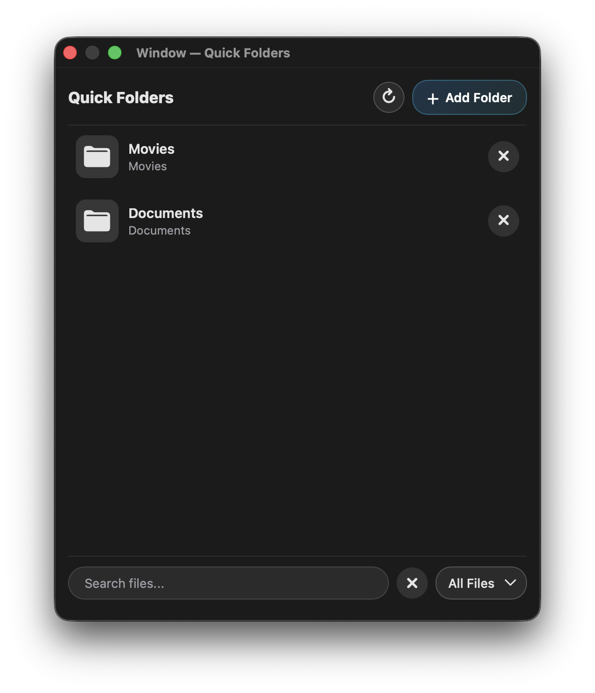

# Quick Folders for IINA

[](https://github.com/JakeCalkins/iina-quick-folders-plugin/actions/workflows/ci.yml)
[](https://github.com/JakeCalkins/iina-quick-folders-plugin/releases/latest)
[](LICENSE)

Quick Folders adds a fast, keyboard-friendly media browser to [IINA](https://iina.io). Pin the folders you use most, search across them, preview metadata, and open media without leaving the player.



## Install

Quick Folders requires IINA 1.4.0 or later.

### Recommended: install from GitHub

1. Open **IINA → Settings → Plugins**.
2. Choose **Install from GitHub**.
3. Paste `JakeCalkins/iina-quick-folders-plugin` (or the full repository URL) and confirm.

Installing from the repository lets IINA discover future plugin updates.

### Install a release package

Download the `.iinaplgz` file from the [latest release](https://github.com/JakeCalkins/iina-quick-folders-plugin/releases/latest), then open it with IINA. New automated releases also include a SHA-256 checksum and GitHub build-provenance attestation.

See the [installation guide](docs/INSTALLATION.md) for upgrades, uninstalling, development installs, and troubleshooting.

## Quick start

1. Press `⌘ ⇧ K` while IINA is active to open Quick Folders.
2. Press `N` or choose **Add Folder**, then select a media folder.
3. Browse a folder, open a smart view, or use search and the file-type filter.
4. Click a file to play it. Use `⌘`/`Ctrl`-click, Shift-click, or the row's selection control to build a selection for bulk actions.
5. Drag one file—or a multi-selection—onto the queue button in the bottom bar. Open the queue to reorder it, then choose **Watch Queue** to open an ordered native IINA playlist containing only those files.

Open **IINA → Settings → Plugins → Quick Folders → Settings** to change shortcuts, media filters, the playback-completion threshold, optional bitrate chips, and indexing depth.

## Features

- User-defined media roots with nested-folder navigation
- Cache-first startup followed by background, per-root index reconciliation
- Fast fuzzy and structured search across the configured index, with inline suggestions and removable filter chips
- Continue Watching, Continue Series, Recently Added, Unwatched, and optional Watched smart views
- Persistent local playback progress, completion state, and conservative resume that defers to IINA's native resume position
- List and poster-grid layouts with windowed rendering for libraries of 100,000 items
- Video, audio, image, and extension filters
- Lazy native thumbnails, generated fallbacks, and optional local `ffmpeg` previews for non-native media
- Priority-aware duration, resolution, codec, sample-rate, channel, type, and file-size chips, with optional bitrate chips
- Modifier, range, keyboard, and select-all multi-selection behavior
- Persistent drag-and-drop queue with bucket and expanded-pane drop targets, multi-item reordering, and native IINA playlist playback
- Bulk watched/unwatched actions that override automatic completion until explicitly changed
- Move selected files to Trash with confirmation
- Light/dark appearance and reduced-motion support
- Searchable command palette with `⌘`/`Ctrl K`, plus a keyboard shortcut reference with `?`
- Privacy-safe, in-memory diagnostics with counts and categorized events only

## Keyboard shortcuts

| Shortcut | Action |
| --- | --- |
| `⌘ ⇧ K` | Open Quick Folders (configurable) |
| `N` | Add a folder (configurable) |
| `⌘/Ctrl K` | Open the command palette |
| `/` or `⌘/Ctrl F` | Focus search |
| `Return` in search | Finish searching and move focus into the results |
| `↑` / `↓` | Move focus through folders and media |
| `Shift ↑` / `Shift ↓` | Extend the media selection |
| `←` | Go up one folder |
| `Return` | Toggle the focused file in a non-contiguous selection, or open a folder |
| `Space` | Play the focused file, or open a folder |
| `⌘/Ctrl A` | Select all visible files |
| `Q` | Add selected files—or the focused file when nothing is selected—to the queue |
| `W` | Mark selected files watched or unwatched |
| `Delete` or `Backspace` | Move selected files to Trash after confirmation |
| `Escape` | Clear selection or close a dialog |
| `?` | Show keyboard shortcut help |

## Search syntax

Search is fuzzy by default, so abbreviations and small typos can still match. Clauses can be combined:

- `summer trip` requires both fuzzy terms
- `"summer trip"` matches a literal phrase
- `summer*.mp4` and `clip-??.mov` use wildcards
- `summer -draft` excludes `draft`
- `ext:mp4`, `ext:m*`, and `-ext:mov` filter extensions
- `is:new`, `is:progress`, `is:watched`, and `is:unwatched` filter playback state
- `duration:>20m` and `resolution:>=1080p` compare media details when available
- `added:>=2026-09-01` filters by the date Quick Folders first observed a file
- `folder:"Documentaries"` narrows results by containing folder

Multiple positive `ext:` clauses are alternatives; other positive clauses must all match.
**Recently Added** and `added:` use first-seen time, because IINA's plugin filesystem API does not expose a portable creation date. Duration and resolution clauses become available as local metadata is inspected and cached.

## Development

The repository has no runtime npm dependencies. Node.js 20+ provides the test and validation commands:

```sh
git clone https://github.com/JakeCalkins/iina-quick-folders-plugin.git
cd iina-quick-folders-plugin
npm run verify
```

For live IINA development setup, architecture, and contribution expectations, see [CONTRIBUTING.md](CONTRIBUTING.md) and [ARCHITECTURE.md](ARCHITECTURE.md).

Release history and pending changes are maintained in [CHANGELOG.md](CHANGELOG.md).

## Support and security

- Review [installation troubleshooting](docs/INSTALLATION.md) before filing a bug.
- Use the repository’s structured [issue forms](https://github.com/JakeCalkins/iina-quick-folders-plugin/issues/new/choose) for bugs and features.
- Report security-sensitive problems according to [SECURITY.md](SECURITY.md), not in a public issue.

Quick Folders works with local paths you choose and requires IINA’s filesystem permission. It does not request network access. Its diagnostics are memory-only and accept only enumerated categories and numeric measurements—never media paths or filenames. File-removal actions move items to Trash and always require confirmation.

## License

Quick Folders is available under the [GNU General Public License v3.0](LICENSE).
